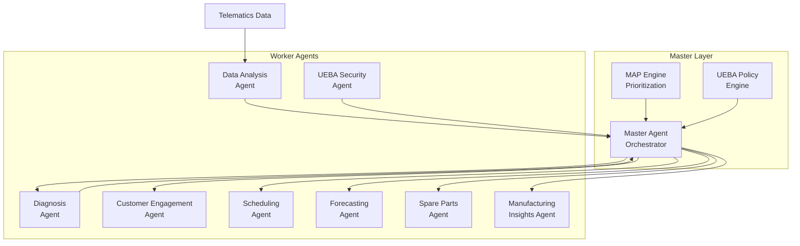

# 🚗 Autonomous Predictive Maintenance Agentic AI System

**An intelligent predictive maintenance platform for automotive OEMs powered by multi-agent AI architecture**

---

## 📋 Project Overview

This project is an **Autonomous Predictive Maintenance Agentic AI System** designed for automotive Original Equipment Manufacturers (OEMs). The system leverages advanced telematics data analysis, machine learning, and multi-agent orchestration to revolutionize vehicle maintenance and service operations.

### Core Capabilities

- 🔍 **Predictive Failure Detection** - Identifies potential vehicle failures before they occur
- 🩺 **Automated Diagnostics** - Converts sensor data into actionable fault summaries
- 💬 **Intelligent Customer Engagement** - AI-powered service recommendations and conversations
- 🎯 **Smart Service Prioritization** - MAP (Maintenance Action Priority) scoring system
- 📅 **Automated Scheduling** - Optimizes service appointments based on urgency and capacity
- 📈 **Demand Forecasting** - Predicts service load 7-30 days in advance
- 🏭 **Manufacturing Insights** - Root cause analysis (RCA) and corrective actions (CAPA)
- 🔒 **Security Monitoring** - UEBA (User and Entity Behavior Analytics) for anomaly detection

---

## 🏗️ Multi-Agent Architecture

The system is designed around a **Master-Worker agent architecture** that orchestrates intelligent decision-making across the entire maintenance lifecycle.



### Master Agent

**Role:** Central orchestrator that coordinates all worker agents

**Responsibilities:**
- Routes telematics data to appropriate analysis agents
- Applies MAP (Multi-Agent Prioritization) to service requests
- Enforces UEBA security policies
- Manages data flow: `Telematics → Diagnosis → Engagement → Scheduling`
- Monitors system health and agent behavior

### Worker Agents

#### 1. 📊 Data Analysis Agent

**Purpose:** Processes raw telematics data and computes dynamic risk profiles

**Key Features:**
- Ingests telematics streams (engine temp, battery voltage, brake wear, odometer)
- Computes **rolling baselines** (mean/std) per vehicle using 6-hour windows
- Applies **EWMA smoothing** (span=7) to reduce noise
- Detects anomalies using:
  - **Z-score detection** (>2σ deviations)
  - **Percent-change analysis** (>10% rapid changes)
  - **Hard threshold monitoring** (industry standards)
- Generates component risk profiles with evidence
- Implements **hysteresis** (2 consecutive windows) to prevent false alarms

**Output:** Risk profiles with severity (Routine/Moderate/Critical), component scores, and evidence tags

---

#### 2. 🩺 Diagnosis Agent

**Purpose:** Converts risk profiles into actionable fault summaries

**Key Features:**
- Maps highest-risk component to specific diagnosis (battery degradation, engine overheating, brake wear, tyre replacement)
- Predicts **RUL (Remaining Useful Life)** in days
- Identifies required parts and estimated costs
- Assigns urgency levels (IMMEDIATE/SOON/ROUTINE)
- Estimates service time requirements

**Output:** Diagnostic reports with RUL, parts list, cost estimates, and service time

---

#### 3. 💬 Customer Engagement Agent (In-car Voice + Chatbot)

**Purpose:** Explains vehicle health to customers in natural language

**Key Features:**
- Generates friendly, contextual service advisor scripts
- Adapts tone based on severity (urgent vs. routine)
- Handles customer questions and objections
- Provides cost transparency and scheduling options
- Maintains conversation history

**Integration Points:**
- In-car voice assistant
- Mobile app chatbot
- Service center communications

**Output:** AI-generated conversation scripts and engagement logs

---

#### 4. 📅 Scheduling Agent

**Purpose:** Optimizes service appointments based on priority and availability

**Key Features:**
- Matches customer preferences with service center availability
- Applies **MAP priority scoring** to select best time slots
- Checks real-time parts availability
- Balances load across multiple service centers
- Handles rescheduling and cancellations

**Output:** Confirmed appointments with slot assignments

---

#### 5. 📈 Service Demand Forecasting Agent

**Purpose:** Predicts future service demand for capacity planning

**Key Features:**
- Analyzes aggregated telematics and risk detections
- Generates **7-day and 30-day load forecasts**
- Factors in seasonal patterns and trends
- Accounts for Critical and Moderate severity vehicles
- Provides per-center capacity recommendations

**Output:** Daily service load predictions with confidence intervals

---

#### 6. 🔧 Predictive Spare-Parts Stocking Agent

**Purpose:** Optimizes inventory levels at service centers

**Key Features:**
- Analyzes diagnosis patterns and scheduled services
- Suggests reorder levels per workshop
- Monitors stock levels (In Stock/Low/Critical)
- Prevents stockouts of critical components
- Optimizes inventory costs

**Output:** Parts availability status and reorder recommendations

---

#### 7. 🏭 Manufacturing Insights Agent (RCA/CAPA)

**Purpose:** Identifies quality issues and suggests manufacturing improvements

**Key Features:**
- Extracts failure patterns from vehicle diagnostics
- Performs **Root Cause Analysis (RCA)**
- Generates **Corrective Actions (CAPA)**
- Suggests **Preventive Actions** to avoid recurrence
- Tracks quality metrics (defect rate, supplier score)
- Monitors warranty claim reduction impact

**Output:** RCA reports, CAPA recommendations, and quality dashboards

---

#### 8. 🔒 UEBA Security Agent

**Purpose:** Monitors agent behavior and enforces security policies

**Key Features:**
- Tracks all agent actions on protected resources
- Detects anomalous behavior patterns
- Blocks unauthorized access attempts
- Generates security event logs with anomaly scores
- Maintains compliance audit trail

**Protected Resources:**
- `telematics_data`
- `booking_slots`
- `dialogue_history`
- `maintenance_records`

**Output:** Access logs, anomaly alerts, and compliance reports

---

## 🔄 System Flow (End-to-End Pipeline)

```
┌─────────────────┐
│  Telematics     │
│  Data Stream    │
└────────┬────────┘
         │
         ▼
┌─────────────────────────┐
│  Data Analysis Agent    │
│  • Rolling baselines    │
│  • Z-score detection    │
│  • Risk scoring         │
└────────┬────────────────┘
         │
         ▼
┌─────────────────────────┐
│   Diagnosis Agent       │
│   • Fault mapping       │
│   • RUL prediction      │
│   • Parts identification│
└────────┬────────────────┘
         │
         ▼
┌─────────────────────────┐
│    Master Agent         │
│    • MAP scoring        │
│    • UEBA validation    │
│    • Route decisions    │
└───┬─────────────────┬───┘
    │                 │
    ▼                 ▼
┌──────────────┐  ┌──────────────┐
│  Customer    │  │  Scheduling  │
│  Engagement  │  │  Agent       │
│  Agent       │  │  + MAP       │
└──────────────┘  └──────┬───────┘
                         │
                         ▼
                  ┌──────────────┐
                  │   Service    │
                  │   Center     │
                  └──────┬───────┘
                         │
                         ▼
                  ┌──────────────┐
                  │Manufacturing │
                  │Insights Agent│
                  └──────────────┘
                         ▲
                         │
                  ┌──────────────┐
                  │ UEBA Agent   │
                  │ (Monitoring) │
                  └──────────────┘
```

### Pipeline Flow Description

1. **Telematics Ingestion** → Raw sensor data streams into the system
2. **Data Analysis** → Risk profiles computed with dynamic scoring
3. **Diagnosis** → Faults identified with RUL and cost estimates
4. **Master Orchestration** → MAP prioritization and routing decisions
5. **Customer Engagement** → AI-powered service recommendations
6. **Scheduling** → Optimized appointments based on priority
7. **Service Execution** → Maintenance performed at service centers
8. **Quality Feedback** → Manufacturing insights for continuous improvement
9. **Security Monitoring** → UEBA agent validates all actions

---

## 📊 Dashboard Implementation (Completed)

The complete **Streamlit Unified Dashboard** has been implemented with 6 comprehensive pages:

### Page 1: 🔧 Vehicle Health Overview

**Features:**
- Vehicle selector dropdown
- Severity badges (🔴 Critical, 🟡 Moderate, 🟢 Routine)
- Risk bar chart showing component breakdown
- Component trend lines (engine temp, battery, brakes)
- Evidence tags with color-coded alerts
- Detailed component cards with progress bars

**Data Source:** `risk_profiles.json`, `telematics_sample_1000.csv`

---

### Page 2: 💬 Customer Engagement

**Features:**
- Conversation timeline with chat bubble styling
- AI Service Advisor script generator
- Regenerate button for new personalized scripts
- Quick action buttons (Call/Email)
- Customer profile cards with diagnosis details

**Data Source:** `engagement_logs.json`, `diagnosis.json`

---

### Page 3: 📅 Scheduling & Forecasting

**Features:**
- Service center dropdown filter
- 7-day and 30-day load forecast charts
- Capacity utilization heatmap
- Available slots table
- Existing bookings table (color-coded by priority)
- Parts availability status cards

**Data Source:** `scheduling.json`, `forecasting.json`

---

### Page 4: 🎯 MAP Prioritization

**Features:**
- Interactive weight sliders (Severity, Tier, Fleet)
- Live priority score recalculation
- Priority table with rankings
- Top 10 vehicles bar chart
- Scheduling order simulation (Day/Time/Bay)
- Score comparison (before/after weight adjustment)

**Data Source:** `map_scores.json`

---

### Page 5: 🏭 Manufacturing Insights

**Features:**
- RCA details (incident, root cause, evidence)
- CAPA section (corrective/preventive actions)
- Quality metrics dashboard
- Warranty claims reduction chart
- Affected vehicle models cluster cards

**Data Source:** `manufacturing.json`

---

### Page 6: 🔒 UEBA Monitoring

**Features:**
- Access control logs table
- Anomaly score timeline (30 days)
- Agent×Resource heatmap
- Severity breakdown (Critical/High/Medium/Low)
- Security metrics and recommendations

**Data Source:** `ueba_logs.json`

---

## 📈 Current Status

### ✅ Completed

- **Full Dashboard Implementation** - All 6 pages with interactive visualizations
- **Data Pipeline** - Dynamic risk scoring with rolling baselines, EWMA, z-scores
- **Analytics Generators** - Diagnosis, forecasting, MAP, scheduling, UEBA
- **Chart Utilities** - Plotly-based visualizations for all metrics
- **Workflow Logic** - Complete end-to-end pipeline design

### 🚧 In Progress

- **Agent Implementation** - Worker agents are being built in **LangFlow**
- **Agent Orchestration** - Master agent coordination is **50% complete**
- **Backend Integration** - Connecting LangFlow agent graph to dashboard APIs

### 📊 Data Status

Currently, the dashboard uses **telematics-derived and simulated data** to demonstrate full functionality:
- Risk profiles computed from actual telematics data
- Diagnosis, scheduling, and forecasting generated based on risk analysis
- Manufacturing and UEBA data simulated for demonstration

**Next Milestone:** Integrate real agent actions from LangFlow into backend and connect to Streamlit dashboard endpoints.

---

## 🚀 How to Run the Project

### Prerequisites

- Python 3.8+
- pip package manager

### Installation

1. **Clone the repository**
   ```bash
   git clone <repository-url>
   cd project
   ```

2. **Install dependencies**
   ```bash
   pip install -r requirements.txt
   ```

3. **Run the dashboard**
   ```bash
   streamlit run app.py
   ```

4. **Access the application**
   - Open your browser to `http://localhost:8501`
   - Click "Regenerate All Data" on the homepage to generate analytics
   - Navigate through the 6 dashboard pages using the sidebar

### What Happens When You Run

1. **Data Loading** - System loads telematics dataset from `data/telematics_sample_1000.csv`
2. **Risk Computation** - Data pipeline computes dynamic risk profiles using:
   - Rolling baselines (6-hour windows)
   - EWMA smoothing (span=7)
   - Z-score deviation detection
   - Percent-change trend analysis
3. **Analytics Generation** - Generates 8 JSON files:
   - `risk_profiles.json` - Vehicle risk assessments
   - `diagnosis.json` - Fault diagnoses with RUL
   - `forecasting.json` - 7-day and 30-day predictions
   - `map_scores.json` - Priority rankings
   - `scheduling.json` - Slots and bookings
   - `engagement_logs.json` - AI conversation examples
   - `manufacturing.json` - RCA/CAPA data
   - `ueba_logs.json` - Security events
4. **Dashboard Rendering** - All 6 pages become fully interactive with real-time data

---

## 🔮 Future Work

### Phase 1: Agent Integration
- [ ] Connect LangFlow agent graph to dashboard backend
- [ ] Implement real-time agent communication via API endpoints
- [ ] Add agent state persistence and memory

### Phase 2: Real-Time Features
- [ ] Live telematics data ingestion from OBD-II devices
- [ ] WebSocket support for real-time dashboard updates
- [ ] Push notifications for critical alerts

### Phase 3: OEM Integration
- [ ] Integration with OEM service center management systems
- [ ] Parts inventory API connections
- [ ] Customer relationship management (CRM) integration

### Phase 4: Advanced ML
- [ ] Deep learning models for failure prediction
- [ ] Reinforcement learning for scheduling optimization
- [ ] Natural language processing for customer sentiment analysis

### Phase 5: Deployment
- [ ] Containerize application (Docker)
- [ ] Deploy dashboard to cloud (AWS/Azure/GCP)
- [ ] Set up CI/CD pipeline
- [ ] Implement production monitoring and logging

---

## 📁 Project Structure

```
project/
├── app.py                          # Main Streamlit dashboard entry
├── requirements.txt                # Python dependencies
├── README.md                       # This file
├── data/                           # Data directory
│   ├── telematics_sample_1000.csv # Raw telematics data
│   ├── risk_profiles.json         # Generated risk assessments
│   ├── diagnosis.json             # Diagnostic reports
│   ├── forecasting.json           # Load forecasts
│   ├── map_scores.json            # Priority rankings
│   ├── scheduling.json            # Appointments
│   ├── engagement_logs.json       # AI conversations
│   ├── manufacturing.json         # RCA/CAPA data
│   └── ueba_logs.json             # Security logs
├── pages/                          # Streamlit multi-page app
│   ├── 1_Vehicle_Health.py        # Vehicle diagnostics page
│   ├── 2_Customer_Engagement.py   # AI conversation page
│   ├── 3_Scheduling_and_Forecasting.py  # Scheduling page
│   ├── 4_MAP_Prioritization.py    # Priority scoring page
│   ├── 5_Manufacturing_Insights.py     # Quality analysis page
│   └── 6_UEBA_Monitoring.py       # Security monitoring page
└── utils/                          # Utility modules
    ├── data_pipeline.py           # Risk computation engine
    ├── generators.py              # Data generators
    ├── loaders.py                 # JSON/CSV loaders
    └── charts.py                  # Plotly visualizations
```

---

## 🛠️ Technology Stack

- **Frontend:** Streamlit (Python)
- **Visualizations:** Plotly
- **Data Processing:** Pandas, NumPy
- **Agent Framework:** LangFlow (in progress)
- **Data Format:** JSON, CSV

---

## 🎯 Use Cases

### For OEMs
- Reduce warranty costs through predictive maintenance
- Improve customer satisfaction with proactive service
- Optimize service center capacity and parts inventory
- Gain manufacturing insights from field data

### For Service Centers
- Prioritize urgent cases with MAP scoring
- Optimize appointment scheduling
- Reduce downtime with accurate forecasting
- Ensure parts availability

### For Customers
- Receive timely service recommendations
- Understand vehicle health in plain language
- Convenient scheduling with AI assistance
- Transparent cost estimates

---

## 📄 License

[Your License Here]

---

## 👥 Contributors

[Your Name/Team]

---

## 📞 Contact

For questions or collaboration opportunities, please contact [your-email@example.com]

---

**Built with ❤️ for the future of automotive maintenance**
